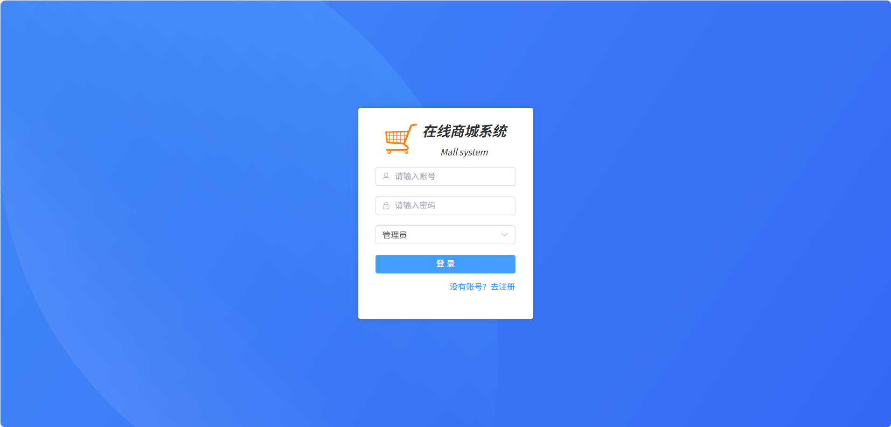
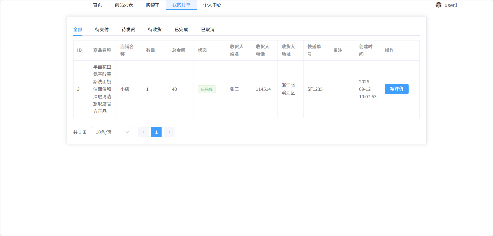
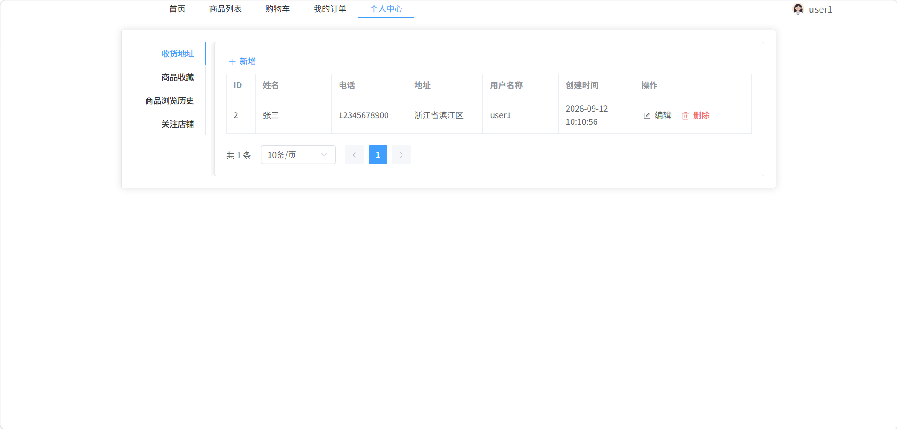
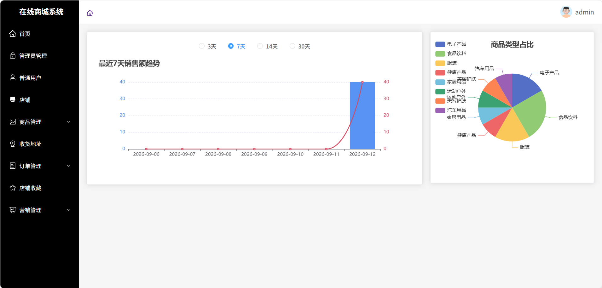
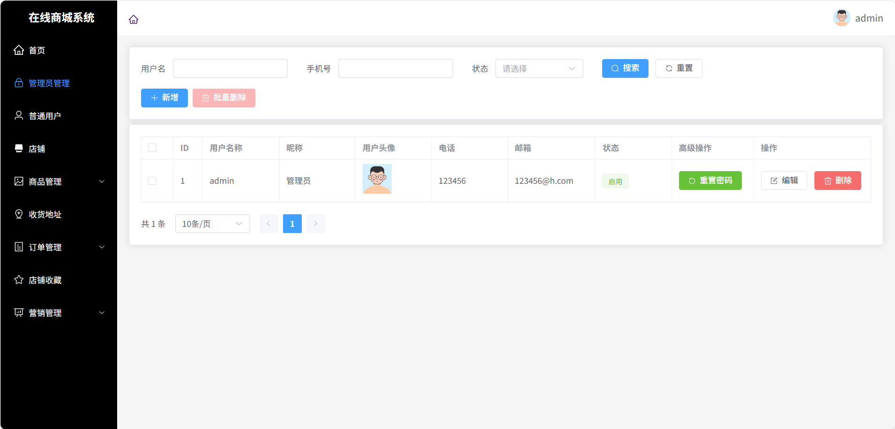
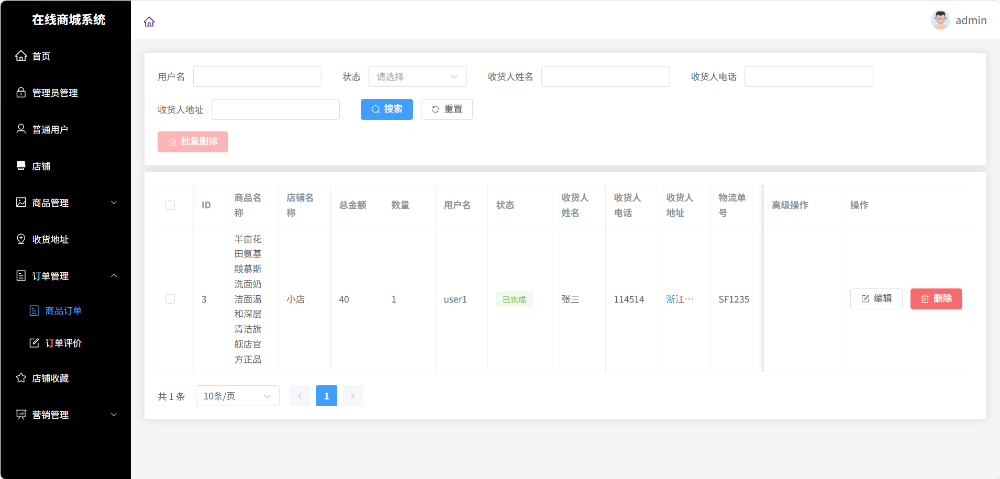
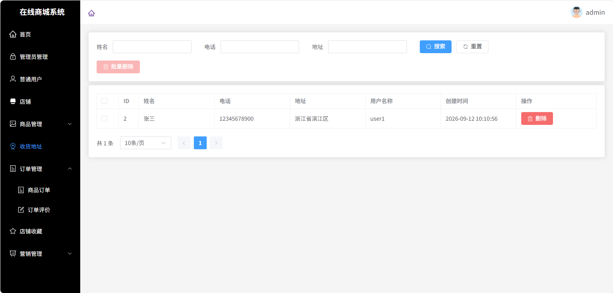
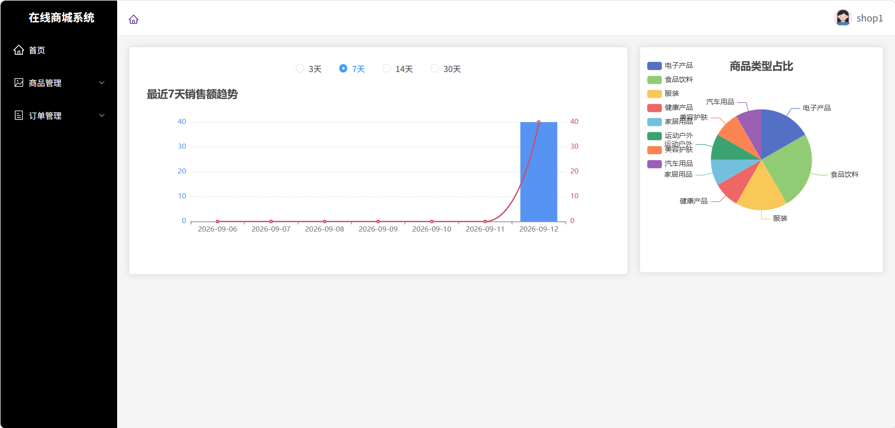
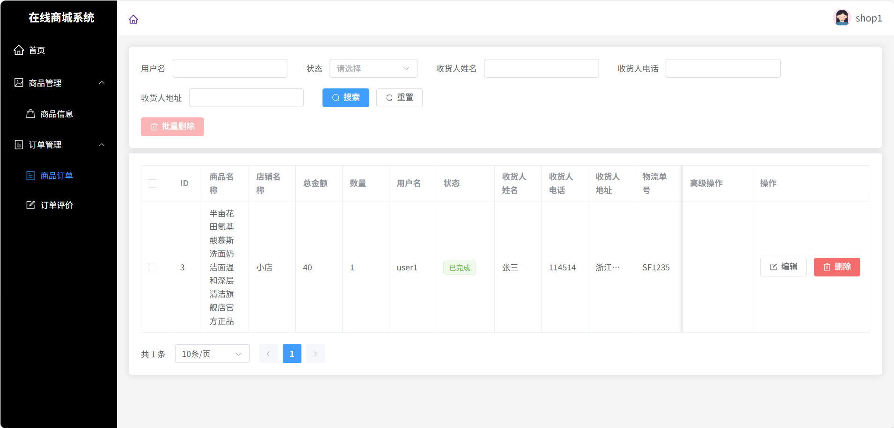

# 商城系统（mall-system）

本科毕业设计项目。一个基于 **Spring Boot 3 + Vue 3** 的前后端分离商城系统，包含**前台商城**与**后台管理**两套界面，支持**管理员 / 普通用户 / 商家**三种角色。

前后端完全分离：后端提供统一 JSON 格式响应的 HTTP 接口，使用 JWT 做登录鉴权；前端使用 Vue 3 组合式 API 开发，并统一封装 Axios 处理请求。

---

## 技术栈

### 后端

| 技术 | 版本 | 说明 |
| --- | --- | --- |
| Java | 17 | 开发语言 |
| Spring Boot | 3.2.10 | 应用框架 |
| MyBatis | 3.0.4 | ORM 框架（XML 映射） |
| MySQL | 8.0 | 数据库（驱动 mysql-connector-j 8.0.31） |
| JJWT | 0.9.1 | JWT 登录令牌生成与校验 |
| Hutool | 5.7.20 | 常用工具库 |
| Fastjson2 | 2.0.53 | JSON 序列化 |
| Spring AOP | - | 切面编程 |
| Lombok | - | 简化实体类代码 |
| Maven | 3.6+ | 项目构建与依赖管理 |

### 前端

| 技术 | 版本 | 说明 |
| --- | --- | --- |
| Vue | 3.4 | 前端框架（`<script setup>` 组合式 API） |
| Vite | 5.3 | 构建工具 / 开发服务器 |
| Element Plus | 2.8 | UI 组件库 |
| Vue Router | 4.4 | 前端路由 |
| Pinia | 2.2 | 状态管理 |
| Axios | 1.7 | HTTP 请求（统一封装拦截器） |
| ECharts | 5.5 | 后台数据统计图表 |
| wangEditor | 5.1 | 富文本编辑器 |
| crypto-js / sm-crypto | - | 加密工具 |

---

## 功能模块

### 前台（商城端）

- **用户体系**：注册、登录（JWT）、退出、修改资料、修改密码
- **首页**：轮播图、广告位、商品分类与推荐
- **商品**：商品列表（按分类 / 店铺筛选）、商品详情
- **购物车**：加入购物车、修改数量、删除、批量结算
- **订单**：下单、订单列表与状态查询、订单评价
- **个人中心**：收藏商品、收藏店铺、浏览历史、收货地址、余额信息

### 后台（管理端）

- **权限与用户**：管理员管理、普通用户管理、店铺管理
- **商品管理**：商品类型、商品信息、商品收藏、浏览历史
- **运营管理**：轮播图、广告位、收货地址、订单评价
- **订单管理**：订单列表、状态跟踪
- **数据统计**：基于 ECharts 的销售总额、商品类型占比等可视化报表

### 角色说明

系统通过登录时传入的 `type` 字段区分角色，共三种：

| 角色 | type 值 | 说明 |
| --- | --- | --- |
| 管理员 | `ADMIN` | 登录后台管理端 |
| 普通用户 | `USER` | 登录前台商城 |
| 商家 | `SHOP` | 店铺账号 |

---

## 项目结构

```
mall-system
├── sql/
│   └── sql.sql                  # 数据库建表与初始数据脚本
├── src/main/java/com/project/platform/
│   ├── ProjectManagement.java   # Spring Boot 启动类
│   ├── config/                  # 跨域、拦截器注册、时间格式等配置
│   ├── controller/              # 接口层（RESTful）
│   ├── service/                 # 业务接口 + impl 实现
│   ├── mapper/                  # MyBatis Mapper 接口
│   ├── entity/                  # 数据库实体
│   ├── dto/ vo/                 # 请求参数对象 / 响应对象
│   ├── exception/               # 自定义异常 + 全局异常处理
│   ├── interceptor/             # 登录拦截器（JWT 校验）
│   └── utils/                   # JWT、ThreadLocal、时间等工具类
├── src/main/resources/
│   ├── application.yaml         # 应用配置（端口、数据源等）
│   └── mapper/*.xml             # MyBatis SQL 映射文件
└── web/                         # 前端工程（Vue 3 + Vite）
    ├── src/
    │   ├── views/front/         # 前台页面
    │   ├── views/admin/         # 后台页面
    │   ├── components/          # 公共组件
    │   ├── router/              # 路由配置
    │   └── utils/http.js        # Axios 封装
    └── vite.config.js
```

---

## 快速开始

### 1. 环境要求

- JDK 17
- Maven 3.6+
- MySQL 8.0+
- Node.js 16+（推荐 18+）

### 2. 初始化数据库

新建数据库 `mall_system`（字符集 `utf8mb4`），然后导入项目自带的脚本：

```bash
mysql -u root -p mall_system < sql/sql.sql
```

也可以直接用 Navicat / MySQL Workbench 导入 `sql/sql.sql`。

### 3. 修改后端配置

编辑 [application.yaml](src/main/resources/application.yaml)，改成你本地的数据库账号密码：

```yaml
spring:
  datasource:
    url: jdbc:mysql://localhost:3306/mall_system?useUnicode=true&useSSL=false&characterEncoding=utf8&serverTimezone=Asia/Shanghai
    username: root
    password: 你的密码
```

### 4. 启动后端

```bash
mvn spring-boot:run
```

启动成功后，后端服务运行在 **http://localhost:1000**。

### 5. 启动前端

```bash
cd web
npm install
npm run dev
```

前端开发服务器默认运行在 **http://localhost:5173**。

### 6. 访问系统

| 入口 | 地址 |
| --- | --- |
| 前台商城 | http://localhost:5173/ |
| 后台管理 | http://localhost:5173/admin |

### 内置测试账号

| 角色 | 用户名 | 密码 |
| --- | --- | --- |
| 管理员 | `admin` | `123456` |
| 普通用户 | `user1` | `123456` |
| 商家 | `shop1` | `123456` |

---

## 关键实现说明

### 统一响应格式

所有接口统一返回 `ResponseVO`：

```json
{
  "code": 200,
  "msg": "操作成功",
  "data": {}
}
```

### JWT 登录鉴权

1. 登录成功后后端用 `JwtUtils` 生成 token 并返回；
2. 前端把 token 存入 `localStorage`，之后每次请求由 Axios 请求拦截器自动加到请求头 `token` 上；
3. 后端 `LoginInterceptor` 拦截 `/**`（放行登录、注册、文件访问接口），校验 token 有效性；
4. 校验通过后把当前用户信息放入 `CurrentUserThreadLocal`（ThreadLocal），便于业务层随时获取当前登录人，请求结束后自动清理；
5. token 无效或过期统一返回 `401`，前端拦截器收到 `401` 后清除本地 token 并跳转登录页。

### 全局异常处理

通过 `@RestControllerAdvice` + 自定义 `CustomException` 统一捕获业务异常并转换为标准响应，避免异常堆栈直接暴露给前端。

### 下单与库存扣减

下单有两个入口：直接下单（`POST /productOrder/add`）和购物车批量结算（`POST /shoppingCart/createOrder`）。核心逻辑在 `ProductOrderServiceImpl.insert()`：

1. **角色校验**：只有普通用户（`USER`）可以下单；
2. **扣减库存**：调用 `ProductServiceImpl.out()` 扣减商品库存并累加销量，库存不足时抛出业务异常，由全局异常处理器统一返回提示；
3. **金额计算**：订单金额由后端按「商品单价 × 数量」计算后写入，不直接使用前端传入的金额，避免被篡改；
4. **写入订单**：订单初始状态为「待支付」。

购物车结算会遍历勾选的购物车记录逐个下单，成功一条就删除对应的购物车记录；遇到库存不足的商品则记录失败原因，最后把失败信息统一返回给前端。

### 订单状态流转

订单状态按业务顺序流转，每次操作前都会校验当前状态，状态不匹配时提示刷新页面：

| 当前状态 | 操作 | 目标状态 | 说明 |
| --- | --- | --- | --- |
| 待支付 | 支付 | 待发货 | 扣除用户余额 |
| 待支付 / 待发货 | 取消 | 已取消 | 回滚商品库存，已支付的退回余额 |
| 待发货 | 发货 | 待收货 | 记录物流单号 |
| 待收货 | 确认收货 | 已完成 | — |

### 分页查询

列表类接口统一使用 MyBatis 手写分页：

- `queryPage`：`ORDER BY id DESC` + `LIMIT #{offset}, #{pageSize}`，并通过 `LEFT JOIN` 关联商品、店铺、用户表取出名称字段；
- `queryCount`：在相同查询条件下单独 `count` 一次总条数；
- 查询条件用 `<where>` + `<if>` 动态拼接，只对传入的条件生效；
- 业务层把 `(pageNum - 1) * pageSize` 作为 offset 传入，并按登录角色注入 `shopId` / `userId` 做数据隔离（商家只看自己店铺的商品、用户只看自己的订单）；
- 最终统一封装为 `PageVO{ list, total }` 返回前端。

### 文件上传

`FilesController` 提供文件上传与访问接口，上传的文件按 UUID 重命名后保存到本地 `uploads/` 目录，访问地址为 `http://localhost:1000/file/{fileName}`。

---

## 项目截图

### 登录页



### 前台商城

**商城首页**


**商品下单**



**个人中心**



### 后台管理

**数据统计首页**



**管理员管理**



**订单管理**



**收货地址管理**



### 商家端

**数据统计首页**



**订单管理**



---

## 说明

本项目为本科毕业设计项目，覆盖用户、商品、订单、购物车、订单评价等模块，完整实现了前后端分离架构下的业务开发流程。
